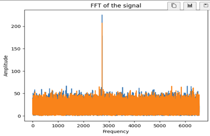
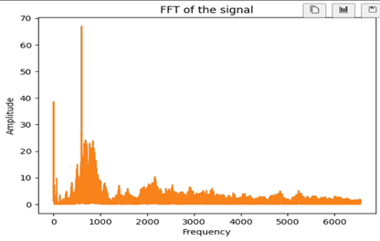
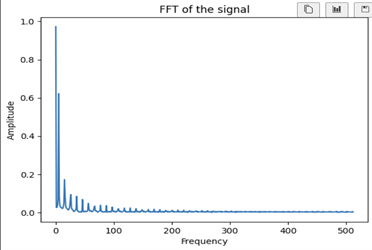

# HandmadeFFT

# 项目过程
## 一、模拟非周期信号生成
除了利用python生成的矩形方波信号以外，还采用了两段音频文件验证了FFT：
### 1、test1.wav文件为加入小幅度随机噪声后的2700Hz纯音：
    sample_rate, samples = wavfile.read('test1.wav')
    noise = 3000 * np.random.randn(len(samples))
    samples = list(np.array(samples) + noise)
    cut_samples_1 = sample_array(samples, 5)
其平均噪音幅度/平均纯音幅度比值为3：10。

### 2、test2.wav 文件采用手机外放一段人声视频，模拟加入噪音后的人声。时长 20.0s。
## 二、FFT频谱近似计算
输入的音频文件样本点密度足够大（如test1.wav的原文件长5s，有240000个样本点，每秒48000个），即使已经完成离散化，仍可以近似看作是模拟信号。

然而，将音频文件直接输入函数中，可能出现样本点数过多，从而导致绘图时过多样本点挤在一起，使作图不直观的情况。为了分散过于密集的样本点，定义以下 sample_array函数，其输入为读取的音频文件的列表Samp以及采样间隔n：

    def sample_array(Samp, n):
        """
        声音信号采集样本点数可能过多，
        需采样降低样本点密度，
        方便绘图
        n:抽样周期
        """
        sampled_values = []
        for i in range(0, len(Samp), n):
            sampled_values.append(Samp[i])
        return sampled_values
适当选取采样间隔，能够使得在对准确度影响不大的情况下，大幅减小运算时间并适当提高绘图精度。经过该函数“采样”的列表，完成了输入信号的预处理。

定义HandmadeFFT类，其中有fft方法与绘制频率图的plot_fft方法。其输入参量为数组signal以及音频时间time。一些基本的参量，如信号长度N等，在初始化的__init__函数里定义。

由于采用2为基的时间抽选FFT算法，需保证运算的数组总长度为2的整数次幂。因此，判断输入数组的长度并将其增广为2的整数次幂。得到用于参与运算的两个参数：

    self.ext_N = 2**(len(signal) - 1).bit_length()
    self.ext_signal = list(self.signal) + [0.0] * (self.ext_N - len(self.signal))

fft函数实现具体的运算过程：迭代地将序列拆分，并采用蝶形运算。
plot_fft方法实现了对单侧频谱的绘制。
以下是关于类的完整定义：

    class HandmadeFFT:
        def __init__(self, signal, time):
            self.signal = signal
            self.N = len(signal)
            self.time = time
            self.ext_N = 2**(len(signal) - 1).bit_length()
            self.ext_signal = list(self.signal) + [0.0] * (self.ext_N - 
            len(self.signal))

        def fft(self):
            if self.ext_N <= 1:
                return self.ext_signal

            even = HandmadeFFT(self.ext_signal[::2],self.time).fft()
            odd = HandmadeFFT(self.ext_signal[1::2],self.time).fft()

            T = [np.exp(-2j * np.pi * k / self.ext_N) * odd[k] for k 
            in range(self.ext_N // 2)]

            return [even[k] + T[k] for k in range(self.ext_N // 2)] + \
                [even[k] - T[k] for k in range(self.ext_N // 2)]

        def plot_fft(self):
            fft_vals = np.array(self.fft())
            P2 = np.abs(fft_vals / self.ext_N)
            P1 = P2[:self.ext_N // 2] * 2  # 单侧频谱
            freq =1000 * np.fft.fftfreq(self.ext_N, 1)
            f = np.linspace(0, (len(self.ext_signal)/self.time) / 2, 
            self.ext_N // 2)
            
            plt.figure()
            plt.plot(f, P1)
            plt.xlabel('Frequency')
            plt.ylabel('Amplitude')
            plt.title('FFT of the signal')
            plt.show()

## 三、频谱结果误差分析
### 1、矩形方波

  

矩形方波的参数为幅度E=1.0，脉冲时长T=0.1。采样时间为1s，采样频率fs = 1000Hz。根据理论分析，其离散傅里叶变换为

  

当且仅当k = 10m (m = 01,2,3...)时，值不为零。从图像看出，0 ~ 100Hz的范围内有10个峰。初步判断运算正确。
值得注意的是，每个峰周围的序列并非严格取0，而是有幅值的迅速衰减，这与DFT的理论分析有所出入。这将在第四节被分析。

### 2、加入噪音的单频信号

  

选取的纯音频率为2700Hz，加入幅度约为纯音幅度0.3倍的随机噪音，从频谱图上看，与预期结果大致相当。

### 3、录制的人声音频信号

  

人谈话的声音频率在500 ~ 2000Hz之间。频谱图中主要的声音信号集中在这一区间，证明程序设计的正确性。

在大约600 ~ 700Hz的区域内出现了一个突出峰，尚不清楚其原因。

高于2000Hz，频域幅度逐渐衰减。此范围内主要为高频噪音。

## 四、进一步分析
以矩形方波信号为例。
前面提到矩形方波频谱应该是10的整数倍时出现的陡峭的峰。如果信号足够理想，应该仅在f = 10m（m为整数）处观察到峰的出现，其余值均为0。然而实际上，无论如何优化采集方法，我们一定得不到这样的峰。我们小组认为，这是由于信号采样时长不是无穷大引起的。下面结合所学知识，对此展开分析。
直观上说，对一个自然信号的观察（采集）时间愈长，我们能够断言其一定是某频率信号的可能性愈大。举生活中的例子，譬如对两盏闪烁的灯持续观察，一开始二者的亮灭在肉眼看来同步，但随着观察时间延长，二者频率之间细微的差异会被逐渐放大，直至可以断言异步。这就是延长时间能够增加频率分辨率的道理。
将采样时间推至极限来说，对一个信号做无穷时长的傅里叶分析，我们一定能够清楚地区分开里面的所有频率的信号。然而实际的信号采样时长都是有限的，这就导致可能对于频率十分接近的两个谐波，我们分不清二者到底谁是这个自然信号的组成部分，抑或是二者都有。从频谱上说，有限时长的信号，其频谱中各个峰的变化一定是“缓变”的。

  

在延长抽样总时长至5s的基础上重复分析，得到下面的频谱图，其频谱的离散化进一步提高，频率分辨率亦得到提高。通过分析，我们可以断言矩形信号中确切地含有某些值的谐波成分：

  

可见提高抽样时长能够提高频率分辨率。

